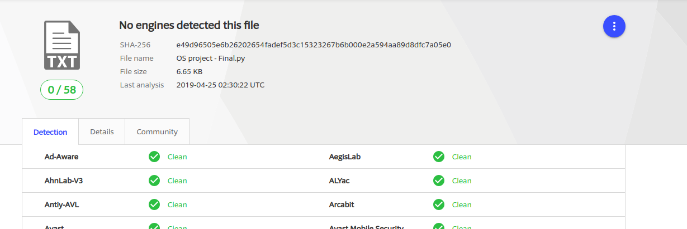

# Zedex-Logger
A logger that stores keystores, mouse clicks, screenshots and send the logs via email.

## WHAT IS ZEDEX-LOGGER
A Python piece of code that not only catches the key strokes of an ordinary user but also keep track of the mouse clicks,
capture screenshot of the currently opened window secretly and send all the captured logs of the victim by email. 

## Features of Zedex-Logger
  * Undetectable by Major Anti Virus
  * Add Zedex-Logger to Windows Startup  
  * Email supported by STMP
  * Data encryption
  * Take Screenshot after specified time interval
  * Email send after specificed time interval
  * Victim’s data is send through Email.
  * Data from victim system will be erased, once it recieved your inbox  
  * can be converted into executable (.exe) file
  
## Virus Total Screenshot: [April, 25, 2019]

# Module Used 
* pynput
* apscheduler
* winreg
* MIME (and it's derivates)
* and some more

## HOW TO USE
Install the required modules imported and you're ready to go. You can alter the code for as per your ease and requirements.
